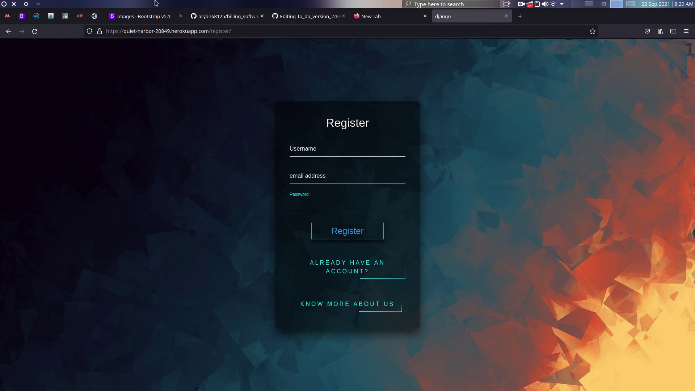
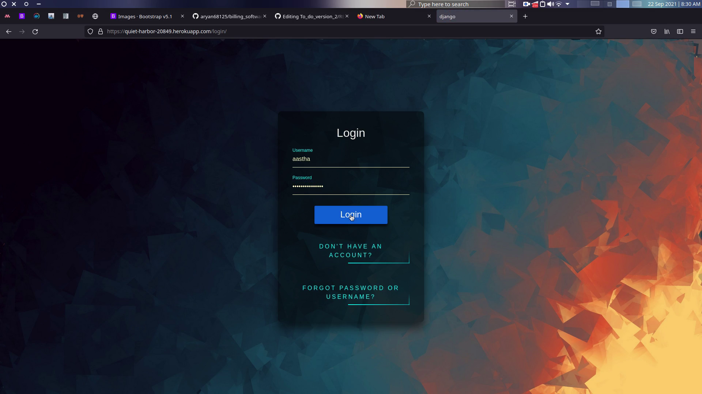
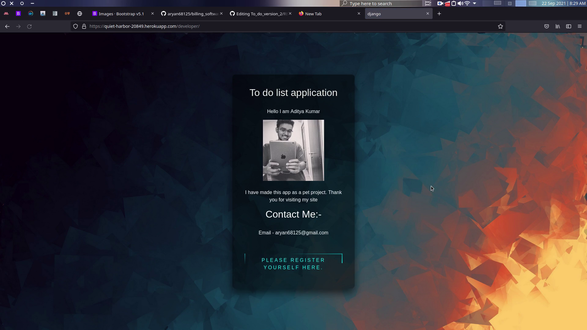
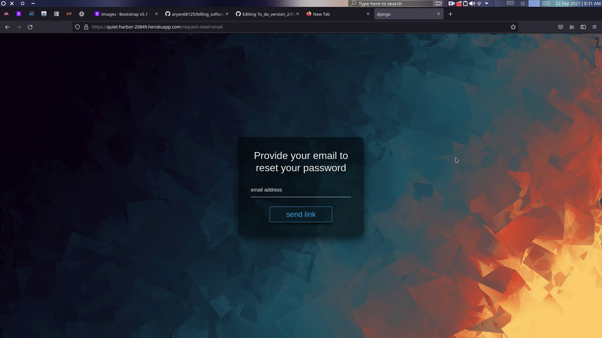
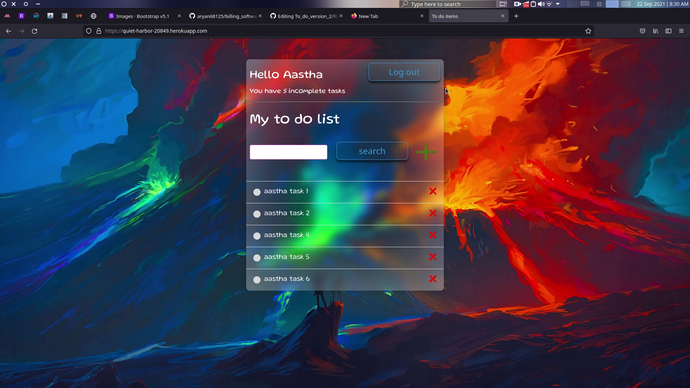
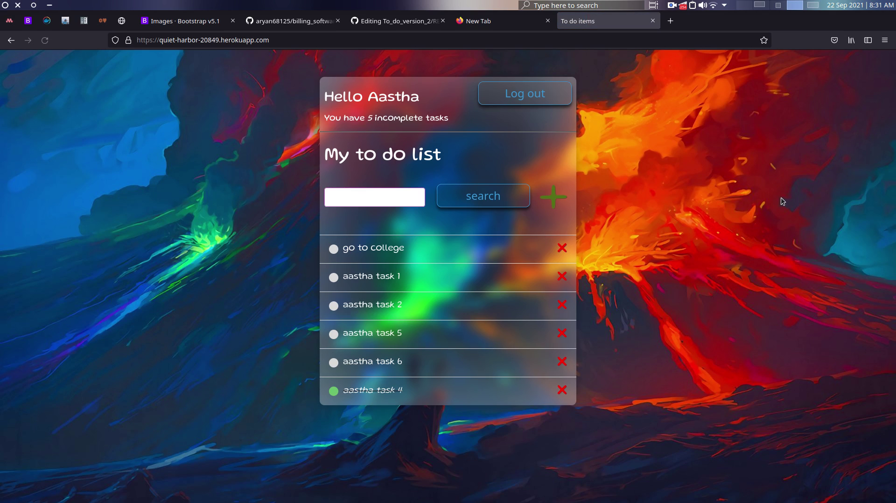
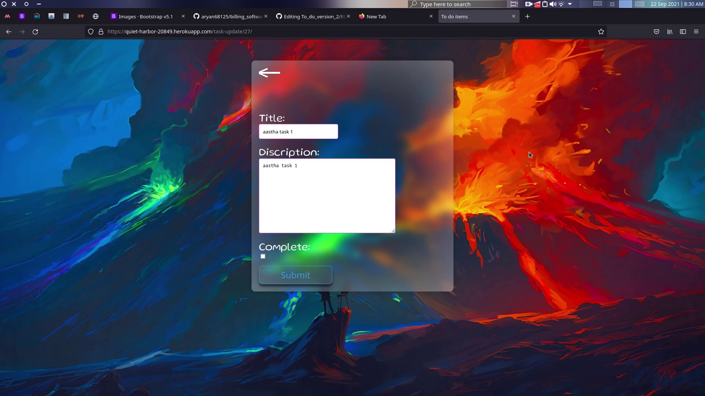
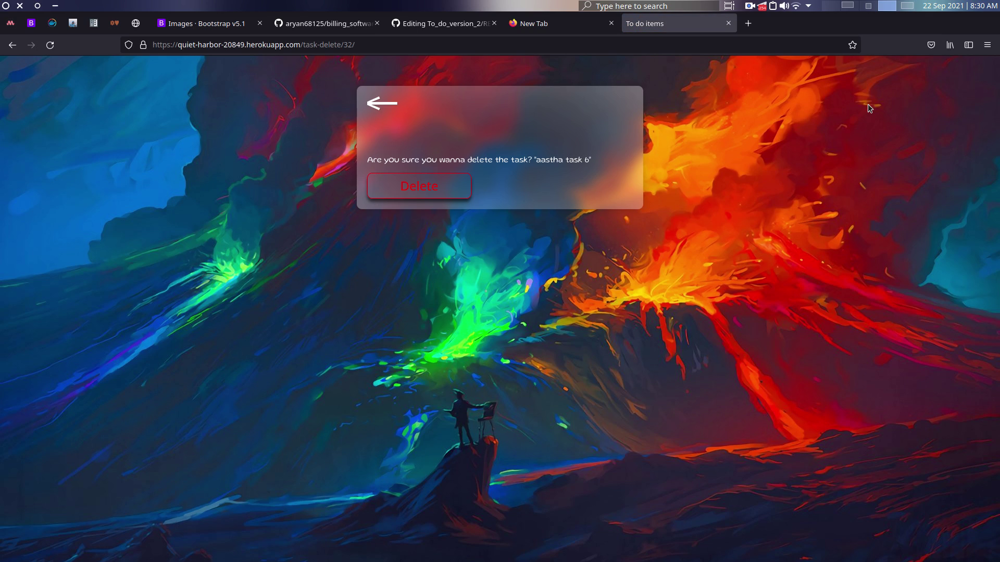

# To_do_version_2
This is a to-do list web application, which allows you to keep track of your daily tasks.

To_do app using class based Views . User registration using email verification method , forgot password verification link via email and user login functions added to the app from the previous version. demonstrates basic create , update and delete functionality

User Registration page
 

User Login page

Developer info page
 

Password Reset page
 

Task List Page
 

Add/Edit Task page

Delete Page
 

You can go and check it out at this link
:-> https://quiet-harbor-20849.herokuapp.com/login/
